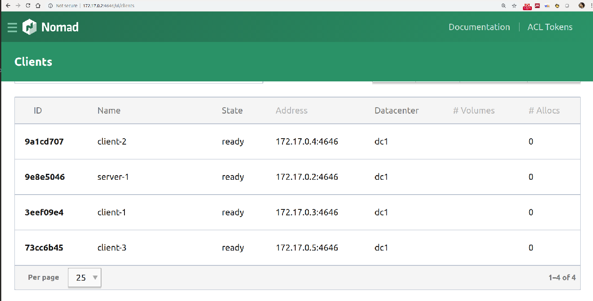
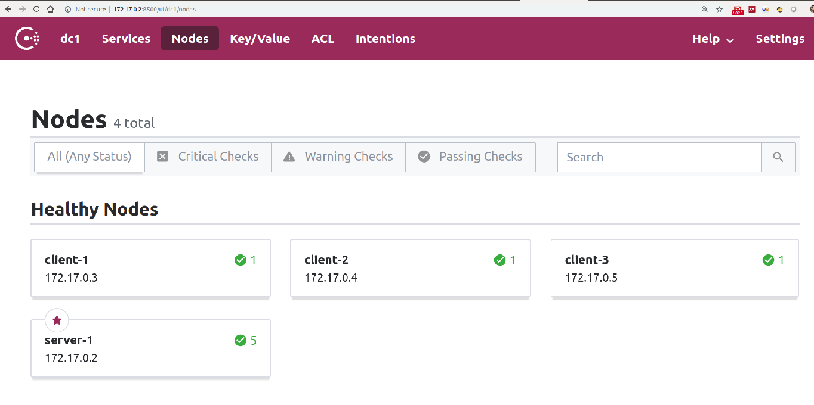
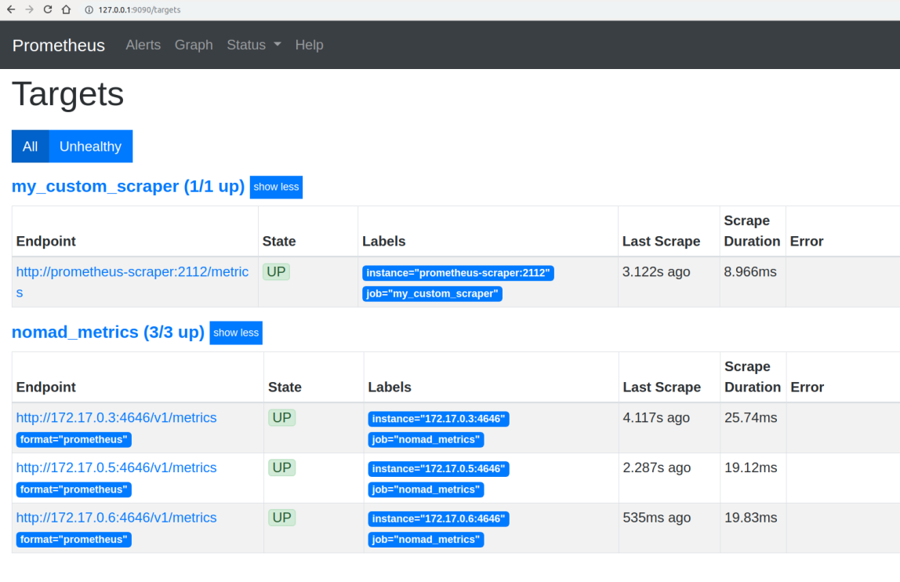
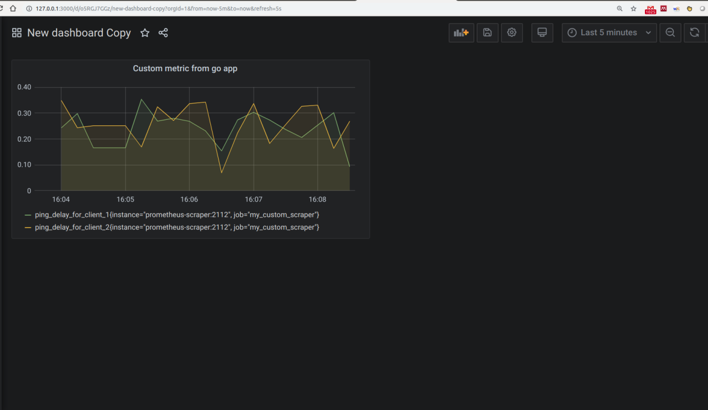

# nomad-prometheus-playground

The goal of this repository is to create a playground of a custom cluster using the hashi-stack (nomad and consul) and getting metrics automatically from prometheus in order to visualize everything using grafana


## Repository structure and building
The whole functionality has been splitted into different folders representing each entity:

### hashi-base-docker
This is an ubuntu18.04 based image with both Consul and Nomad binaries already installed. Just build it:


```
cd hashi-base-docker && docker-compose build 
```

### cluster-client-docker
Using the previously built image, this image represent a client in the cluster that includes the Consul and Nomads services running at the same time. The variables $CONSUL_MASTER_ADDR and $NOMAD_MASTER_ADDR are configured in runtime. The telemetry stanza is configured to report nomad status to prometheus.


```
cd cluster-client-docker && docker-compose build 
```

### cluster-server-docker
Same concept for the server machines. In this case, our cluster will have a single server (bootstrap_expect = 1)


```
cd cluster-server-docker && docker-compose build 
```

### prometheus-scraper
We will use a golang application to create a custom metric and send it to prometheus. In this case, we will ping our client-X instances and push the RTT (time from ping command) to prometheus every 5 seconds. The docker image uses the official golang image and compiles the code and generate the binary.

```
cd prometheus-scraper && docker-compose build 
```

### prometheus-docker
Using a multistage build from the original prometheus docker image, a custom image is created in order to use a template for the config file in runtime.

```
cd prometheus-docker && docker-compose build 
```


## Running the example
After all the required images have been generated, just start everything from the root docker-compose.yaml file

```
docker-compose up
```

We use the default bridge network, and let the server be the first instantiated docker (172.17.0.2). From now on, the following services are available from your browser:

* nomad server UI: http://172.17.0.2:8500
* consul server UI : http://172.17.0.2:8500
* Prometheus UI: http://127.0.0.1:9090
* Grafana UI: http://127.0.0.1:8500


## Screenshots
### Nomad cluster


## Consul cluster


## Prometheus targets


## Grafana Go App visualization



